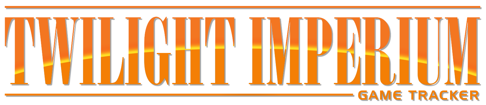

 

  

  <h3 align="center">Twilight Imperium - Game Tracker</h3>

  

    A web application to keep track of core activities during a game of TI4.
     
     
    <a href="https://github.com/brettspielpony/TwilightImperiumGameTracker">View Demo</a>
    ·
    <a href="https://github.com/brettspielpony/TwilightImperiumGameTracker/issues">Report Bug</a>
    ·
    <a href="https://github.com/brettspielpony/TwilightImperiumGameTracker/issues">Request Feature</a>
  

## Table of Contents

* [About the Project](#about-the-project)
* [Contributing](#contributing)
* [License](#license)
* [Disclaimer](#disclaimer)

## About The Project

[Twilight Imperium](https://www.fantasyflightgames.com/en/products/twilight-imperium-fourth-edition/) is a board game about galactic conquest for three to six players. It is an epic experience and a lot of fun. But the game is also quite complex and long. Very long. A typical game might take some good 6 hours. While all this is part of the fun, things can get a bit overwhelming to keep track of. Additionally it is nice to look back at a game and see what strategies work well and what didn't worked well, with the goal to get better next time.

And that's where "Twilight Imperium - Game Tracker" comes enters the stage. The goals of this app is:

1. Provide an easy to use way to track progress during a game
1. Make this progress easily accessible to all players during a game
1. Present an overview of the already scored objectives and open objectives
1. Track basic timing information for each game
1. Store and display the map of each game
1. Make all of the above data accessible after a game for further analysis

The concrete features will evolve over time, but those are our guiding lights so far.

## Contributing

We don't only want to provide a companion app for TI4, but want to have a playground application to improve and teach web development skills. If you're interested in contributing to this project feel free to look at the issues or even open one by yourself at https://github.com/brettspielpony/TwilightImperiumGameTracker/issues. This project is intended to be a safe, welcoming space for collaboration, and contributors are expected to adhere to the [Contributor Covenant](http://contributor-covenant.org) code of conduct.

## License

Distributed under the MIT License. See `LICENSE` for more information.

## Disclaimer

This project has not been officially approved or is any other way associated with Fantasy Flight Games. [Twilight Imperium Fourth Edition](https://www.fantasyflightgames.com/en/products/twilight-imperium-fourth-edition/) is a board game created and owned by Fantasy Flight Games. All copyright belongs to [Fantasy Flight Games](https://www.fantasyflightgames.com/en/index/).
